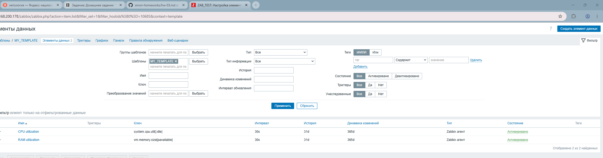
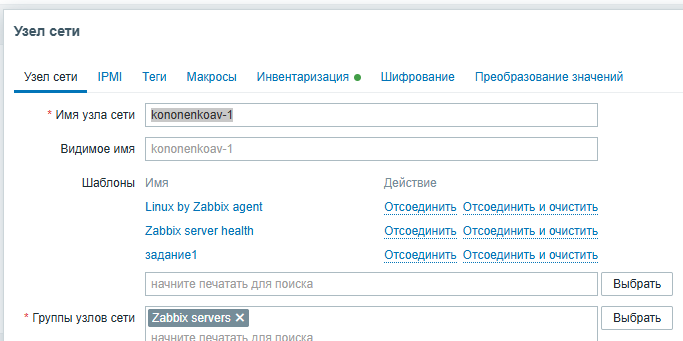
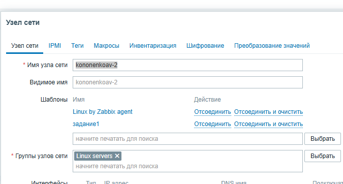
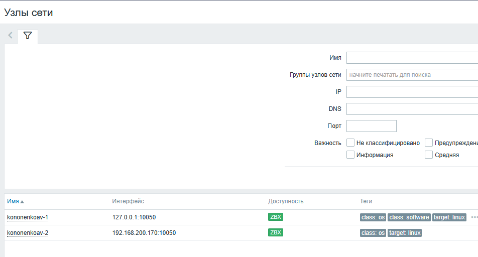

# Кононенко Александр  Домашнее задание к занятию "Система мониторинга Zabbix Часть два "

## Задание 1
Создайте свой шаблон, в котором будут элементы данных, мониторящие загрузку CPU и RAM хоста.
### Скриншот Решения 

### Задания 2.3
## Привязка шаблона к хостам

### ДОступность Хостов

