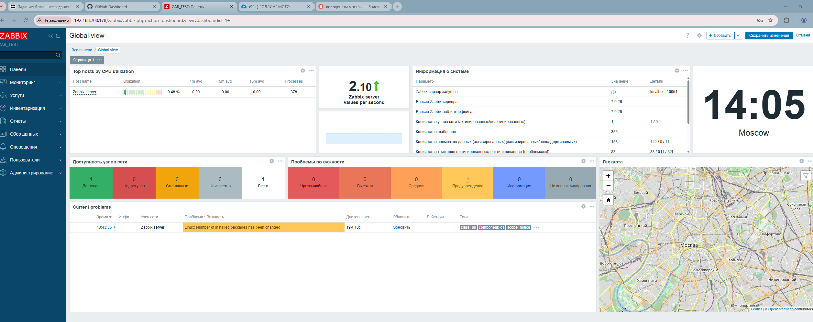

Задание 1  
Установите Zabbix Server с веб-интерфейсом.

Процесс выполнения:

Установка PostgreSQL  
Установка репозитория Zabbix  
Установка Zabbix сервера, веб-интерфейса и агента  
Создание и настройка базы данных  
Настройка Zabbix сервера  
Запуск и включение служб  

Использованные команды:

# Установка PostgreSQL
dnf install postgresql-server postgresql-contrib -y
postgresql-setup --initdb
systemctl start postgresql
systemctl enable postgresql

# Установка репозитория Zabbix
rpm -Uvh https://repo.zabbix.com/zabbix/7.0/centos/9/x86_64/zabbix-release-latest-7.0.el9.noarch.rpm
dnf clean all

# Установка Zabbix сервера, веб-интерфейса и агента
dnf install zabbix-server-pgsql zabbix-web-pgsql zabbix-apache-conf zabbix-sql-scripts zabbix-selinux-policy zabbix-agent -y

# Создание базы данных
sudo -u postgres createuser --pwprompt zabbix
sudo -u postgres createdb -O zabbix zabbix

# Импорт начальной схемы и данных
zcat /usr/share/zabbix-sql-scripts/postgresql/server.sql.gz | sudo -u zabbix psql zabbix

# Настройка базы данных для Zabbix сервера
# В файле /etc/zabbix/zabbix_server.conf указать:
# DBPassword=ВАШ_ПАРОЛЬ_ОТ_ПОЛЬЗОВАТЕЛЯ_zabbix

# Запуск процессов Zabbix сервера и агента, веб-сервера и PHP-FPM
systemctl restart zabbix-server zabbix-agent httpd php-fpm
systemctl enable zabbix-server zabbix-agent httpd php-fpm

**Скриншот авторизации в админке:**

